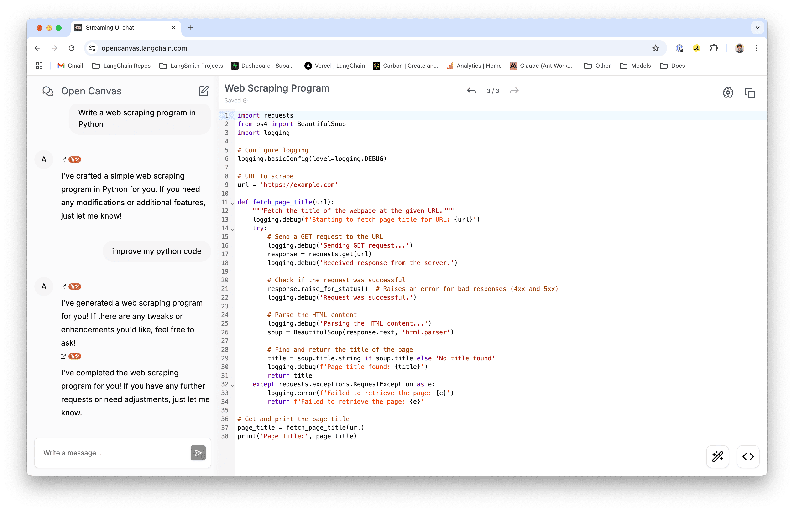

# Open Canvas

[TRY IT OUT HERE](https://opencanvas.langchain.com/)



Open Canvas is an open source web application for collaborating with agents to better write documents. It is inspired by [OpenAI's "Canvas"](https://openai.com/index/introducing-canvas/), but with a few key differences.

1. **Open Source**: All the code, from the frontend, to the content generation agent, to the reflection agent is open source and MIT licensed.
2. **Built in memory**: Open Canvas ships out of the box with a [reflection agent](https://langchain-ai.github.io/langgraphjs/tutorials/reflection/reflection/) which stores style rules and user insights in a [shared memory store](https://langchain-ai.github.io/langgraphjs/concepts/memory/). This allows Open Canvas to remember facts about you across sessions.
3. **Start from existing documents**: Open Canvas allows users to start with a blank text, or code editor in the language of their choice, allowing you to start the session with your existing content, instead of being forced to start with a chat interaction. We believe this is an ideal UX because many times you will already have some content to start with, and want to iterate on-top of it.

## Features

- **Memory**: Open Canvas has a built in memory system which will automatically generate reflections and memories on you, and your chat history. These are then included in subsequent chat interactions to give a more personalized experience.
- **Custom quick actions**: Custom quick actions allow you to define your own prompts which are tied to your user, and persist across sessions. These then can be easily invoked through a single click, and apply to the artifact you're currently viewing.
- **Pre-built quick actions**: There are also a series of pre-built quick actions for common writing and coding tasks that are always available.
- **Artifact versioning**: All artifacts have a "version" tied to them, allowing you to travel back in time and see previous versions of your artifact.
- **Code, Markdown, or both**: The artifact view allows for viewing and editing both code, and markdown. You can even have chats which generate code, and markdown artifacts, and switch between them.
- **Live markdown rendering & editing**: Open Canvas's markdown editor allows you to view the rendered markdown while you're editing, without having to toggle back and fourth.

## Setup locally

This guide will cover how to setup and run Open Canvas locally. If you prefer a YouTube video guide, check out [this video](https://youtu.be/sBzcQYPMekc).

### Prerequisites

Open Canvas requires the following API keys and external services:

#### Package Manager

- [Yarn](https://yarnpkg.com/)

#### LLM APIs

- [OpenAI API key](https://platform.openai.com/signup/)
- [Anthropic API key](https://console.anthropic.com/)
- (optional) [Google GenAI API key](https://aistudio.google.com/apikey)
- (optional) [Fireworks AI API key](https://fireworks.ai/login)

#### Authentication

- [Supabase](https://supabase.com/) account for authentication

#### LangGraph Server

- [LangGraph CLI](https://langchain-ai.github.io/langgraph/cloud/reference/cli/) for running the graph locally

#### LangSmith

- [LangSmith](https://smith.langchain.com/) for tracing & observability

### Installation

First, clone the repository:

```bash
git clone https://github.com/langchain-ai/open-canvas.git
cd open-canvas
```

Next, install the dependencies:

```bash
yarn install
```

After installing dependencies, copy the `.env.example` file contents into `.env` and set the required values:

```bash
cp .env.example .env
```

Then, setup authentication with Supabase.

### Setup Authentication

After creating a Supabase account, visit your [dashboard](https://supabase.com/dashboard/projects) and create a new project.

Next, navigate to the `Project Settings` page inside your project, and then to the `API` tag. Copy the `Project URL`, and `anon public` project API key. Paste them into the `NEXT_PUBLIC_SUPABASE_URL` and `NEXT_PUBLIC_SUPABASE_ANON_KEY` environment variables in the `.env` file.

After this, navigate to the `Authentication` page, and the `Providers` tab. Make sure `Email` is enabled (also ensure you've enabled `Confirm Email`). You may also enable `GitHub`, and/or `Google` if you'd like to use those for authentication. (see these pages for documentation on how to setup each provider: [GitHub](https://supabase.com/docs/guides/auth/social-login/auth-github), [Google](https://supabase.com/docs/guides/auth/social-login/auth-google))

#### Test authentication

To verify authentication works, run `yarn dev` and visit [localhost:3000](http://localhost:3000). This should redirect you to the [login page](http://localhost:3000/auth/login). From here, you can either login with Google or GitHub, or if you did not configure these providers, navigate to the [signup page](http://localhost:3000/auth/signup) and create a new account with an email and password. This should then redirect you to a conformation page, and after confirming your email you should be redirected to the [home page](http://localhost:3000).

### Setup LangGraph Server

Now we'll cover how to setup and run the LangGraph server locally.

Follow the [`Installation` instructions in the LangGraph docs](https://langchain-ai.github.io/langgraph/cloud/reference/cli/#installation) to install the LangGraph CLI.

Once installed, navigate to the root of the Open Canvas repo and run `yarn dev:server` (this runs `npx @langchain/langgraph-cli dev --port 54367`).

Once it finishes pulling the docker image and installing dependencies, you should see it log:

```
Ready!
- 🚀 API: http://localhost:54367
- 🎨 Studio UI: https://smith.langchain.com/studio?baseUrl=http://localhost:54367
```

After your LangGraph server is running, execute the following command to start the Open Canvas app:

```bash
yarn dev
```

On initial load, compilation may take a little bit of time.

Then, open [localhost:3000](http://localhost:3000) with your browser and start interacting!

## LLM Models

Open Canvas is designed to be compatible with any LLM model. The current deployment has the following models configured:

- **Anthropic Claude 3 Haiku 👤**: Haiku is Anthropic's fastest model, great for quick tasks like making edits to your document. Sign up for an Anthropic account [here](https://console.anthropic.com/).
- **Fireworks Llama 3 70B 🦙**: Llama 3 is a SOTA open source model from Meta, powered by [Fireworks AI](https://fireworks.ai/). You can sign up for an account [here](https://fireworks.ai/login).
- **OpenAI GPT 4o Mini 💨**: GPT 4o Mini is OpenAI's newest, smallest model. You can sign up for an API key [here](https://platform.openai.com/signup/).

If you'd like to add a new model, follow these simple steps:

1. Add to or update the model provider variables in `constants.ts`.
2. Install the necessary package for the provider (e.g. `@langchain/anthropic`).
3. Update the `getModelConfig` function in `src/agent/utils.ts` to include an `if` statement for your new model name and provider.
4. Manually test by checking you can:
   > - 4a. Generate a new artifact
   > - 4b. Generate a followup message (happens automatically after generating an artifact)
   > - 4c. Update an artifact via a message in chat
   > - 4d. Update an artifact via a quick action
   > - 4e. Repeat for text/code (ensure both work)

### Local Ollama models

Open Canvas supports calling local LLMs running on Ollama. This is not enabled in the hosted version of Open Canvas, but you can use this in your own local/deployed Open Canvas instance.

To use a local Ollama model, first ensure you have [Ollama](https://ollama.com) installed, and a model that supports tool calling pulled (the default model is `llama3.3`).

Next, start the Ollama server by running `ollama run llama3.3`.

Then, set the `NEXT_PUBLIC_OLLAMA_ENABLED` environment variable to `true`, and the `OLLAMA_API_URL` environment variable to the URL of your Ollama server (defaults to `http://host.docker.internal:11434`. If you do not set a custom port when starting your Ollama server, you should not need to set this environment variable).

> [!NOTE]
> Open source LLMs are typically not as good at instruction following as proprietary models like GPT-4o or Claude Sonnet. Because of this, you may experience errors or unexpected behavior when using local LLMs.

## Troubleshooting

Below are some common issues you may run into if running Open Canvas yourself:

- **I have the LangGraph server running successfully, and my client can make requests, but no text is being generated:** This can happen if you start & connect to multiple different LangGraph servers locally in the same browser. Try clearing the `oc_thread_id_v2` cookie and refreshing the page. This is because each unique LangGraph server has its own database where threads are stored, so a thread ID from one server will not be found in the database of another server.

- **I'm getting 500 network errors when I try to make requests on the client:** Ensure you have the LangGraph server running, and you're making requests to the correct port. You can specify the port to use by passing the `--port <PORT>` flag to the `npx @langchain/langgraph-cli dev` command, and you can set the URL to make requests to by either setting the `LANGGRAPH_API_URL` environment variable, or by changing the fallback value of the `LANGGRAPH_API_URL` variable in `constants.ts`.

- **I'm getting "thread ID not found" error toasts when I try to make requests on the client:** Ensure you have the LangGraph server running, and you're making requests to the correct port. You can specify the port to use by passing the `--port <PORT>` flag to the `npx @langchain/langgraph-cli dev` command, and you can set the URL to make requests to by either setting the `LANGGRAPH_API_URL` environment variable, or by changing the fallback value of the `LANGGRAPH_API_URL` variable in `constants.ts`.

- **`Model name is missing in config.` error is being thrown when I make requests:** This error occurs when the `customModelName` is not specified in the config. You can resolve this by setting the `customModelName` field inside `config.configurable` to the name of the model you want to use when invoking the graph. See [this doc](https://langchain-ai.github.io/langgraphjs/how-tos/configuration/) on how to use configurable fields in LangGraph.

## Roadmap

### Features

Below is a list of features we'd like to add to Open Canvas in the near future:

- **Render React in the editor**: Ideally, if you have Open Canvas generate React (or HTML) code, we should be able to render it live in the editor. **Edit**: This is in the planning stage now!
- **Multiple assistants**: Users should be able to create multiple assistants, each having their own memory store.
- **Give assistants custom 'tools'**: Once we've implemented `RemoteGraph` in LangGraph.js, users should be able to give assistants access to call their own graphs as tools. This means you could customize your assistant to have access to current events, your own personal knowledge graph, etc.

Do you have a feature request? Please [open an issue](https://github.com/langchain-ai/open-canvas/issues/new)!

### Contributing

We'd like to continue developing and improving Open Canvas, and want your help!

To start, there are a handful of GitHub issues with feature requests outlining improvements and additions to make the app's UX even better.
There are three main labels:

- `frontend`: This label is added to issues which are UI focused, and do not require much if any work on the agent(s).
- `ai`: This label is added to issues which are focused on improving the LLM agent(s).
- `fullstack`: This label is added to issues which require touching both the frontend and agent code.

If you have questions about contributing, please reach out to me via email: `brace(at)langchain(dot)dev`. For general bugs/issues with the code, please [open an issue on GitHub](https://github.com/langchain-ai/open-canvas/issues/new).
