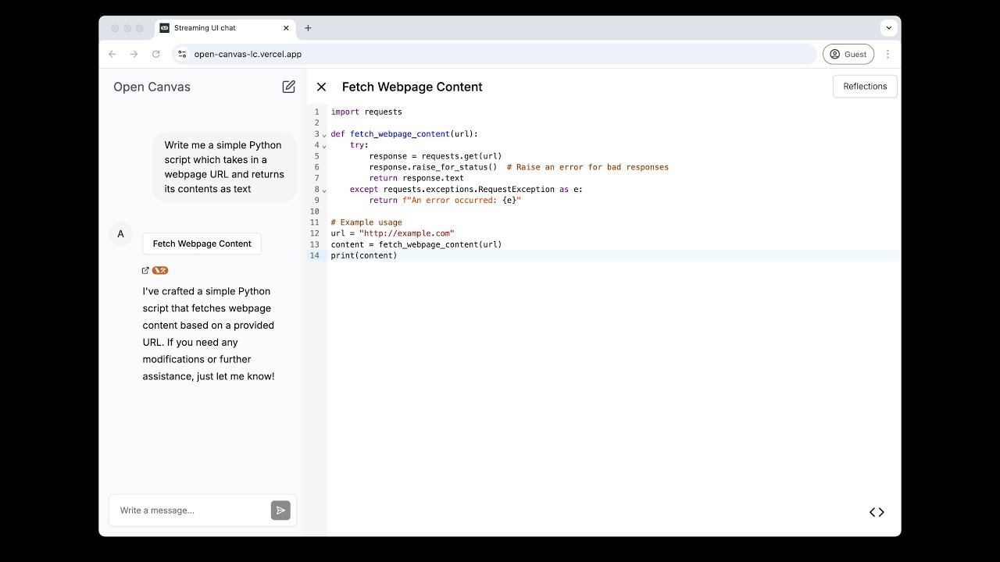

# Open Canvas

[TRY IT OUT HERE](https://open-canvas-lc.vercel.app)



Open Canvas is an open source web application for collaborating with agents to better write documents. It is inspired by [OpenAI's "Canvas"](https://openai.com/index/introducing-canvas/), but with a few key differences.

1. **Open Source**: All the code, from the frontend, to the content generation agent, to the reflection agent is open source and MIT licensed.
2. **Built in memory**: Open Canvas ships out of the box with a [reflection agent](https://langchain-ai.github.io/langgraphjs/tutorials/reflection/reflection/) which stores style rules and user insights in a [shared memory store](https://langchain-ai.github.io/langgraphjs/concepts/memory/). This allows Open Canvas to remember facts about you across sessions.
3. **Start from existing documents**: Open Canvas allows users to start with a blank text, or code editor in the language of their choice, allowing you to start the session with your existing content, instead of being forced to start with a chat interaction. We believe this is an ideal UX because many times you will already have some content to start with, and want to iterate on-top of it.

## How to use

You can use our deployed version for free by visiting [open-canvas-lc.vercel.app](https://open-canvas-lc.vercel.app/)

or

You can clone this repository and run locally/deploy to your own cloud. See the next section for steps on how to do this.


## Development

Running or developing Open Canvas is easy. Start by cloning this repository and navigating into the directory.

```bash
git clone https://github.com/langchain-ai/open-canvas.git

cd open-canvas
```

Next, install the dependencies via Yarn:

```bash
yarn install
```

Then [install LangGraph Studio](https://studio.langchain.com/) which is required to run the graphs locally, or [create a LangSmith account](https://smith.langchain.com/) to deploy to production on LangGraph Cloud.

After that, copy the `.env.example` file contents into `.env` and set the required values:

```bash
# LangSmith tracing (optional, but recommended.)
LANGCHAIN_TRACING_V2=true
LANGCHAIN_API_KEY=

# LLM API keys
# Anthropic used for reflection
ANTHROPIC_API_KEY=
# OpenAI used for content generation
OPENAI_API_KEY=

# LangGraph Deployment, or local development server via LangGraph Studio.
LANGGRAPH_API_URL=
```

Finally, start the development server:

```bash
yarn dev
```

Then, open [localhost:3000](http://localhost:3000) with your browser and start interacting!

You can also watch a short (2 min) video walkthrough on how to setup Open Canvas locally [here](https://www.loom.com/share/e2ce559840f14a9abf1b3d5af7686271).

## Roadmap

### Features

Below is a list of features we'd like to add to Open Canvas in the near future:

- **Artifact versioning**: Like in Google Docs, you should be able to go back in time and see previous versions of your artifact.
- **Render React in the editor**: Ideally, if you have Open Canvas generate React (or HTML) code, we should be able to render it live in the editor.
- **Custom quick actions**: Allow users to define their own quick actions which will persist across sessions.
- **Multiple assistants**: Users should be able to create multiple assistants, each having their own memory store.
- **Give assistants custom 'tools'**: Once we've implemented `RemoteGraph` in LangGraph.js, users should be able to give assistants access to call their own graphs as tools. This means you could customize your assistant to have access to current events, your own personal knowledge graph, etc.
- **Live markdown renderer**: Markdown code should be rendered live and be editable at the same time.

Do you have a feature request? Please [open an issue](https://github.com/langchain-ai/open-canvas/issues/new)!

### Contributing

We'd like to continue developing and improving Open Canvas, and want your help!

To start, there are a handful of GitHub issues with feature requests outlining improvements and additions to make the app's UX even better.
There are three main labels:

- `frontend`: This label is added to issues which are UI focused, and do not require much if any work on the agent(s).
- `ai`: This label is added to issues which are focused on improving the LLM agent(s).
- `fullstack`: This label is added to issues which require touching both the frontend and agent code.

If you have questions about contributing, please reach out to me via email: `brace(at)langchain(dot)dev`. For general bugs/issues with the code, please [open an issue on GitHub](https://github.com/langchain-ai/open-canvas/issues/new).
